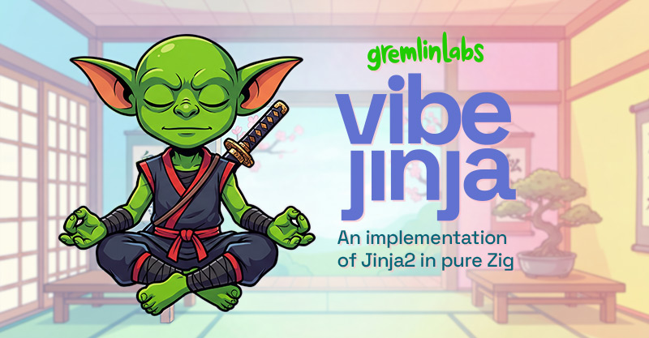

# Vibe Jinja



**A high-performance, Jinja2-compatible template engine for Zig.**

Vibe Jinja implements the Jinja syntax and runtime features used by web templates, code generators, configuration tools, and Hugging Face chat templates. It is written in Zig 0.15.2, has no runtime dependencies beyond the Zig standard library, and exposes both AST and bytecode-backed rendering paths.

The project targets practical Jinja2 compatibility. Its unit and integration suites cover inheritance, includes, imports, macros, filters, tests, autoescaping, slicing, and production chat-template fixtures. Compatibility is not claimed for every Python/Jinja2 extension or edge case; consumers should test their own templates against both engines.

Vibe Jinja is also a core component of [Vibe Mode](https://vibemode.ai).

## Performance

On the checked-in render-only comparison suite, Vibe Jinja is faster than Python Jinja2 in all four comparable scenarios:

| Benchmark | Python Jinja2 avg | Vibe Jinja avg | Speedup |
| --- | ---: | ---: | ---: |
| Simple template | 3,450 ns | 877 ns | 3.93x |
| Loop template | 4,485 ns | 652 ns | 6.88x |
| Conditional | 3,414 ns | 139 ns | 24.56x |
| Filter chain | 4,006 ns | 222 ns | 18.05x |

Measured on 2026-07-14 on Apple Silicon with Zig 0.15.2 ReleaseFast, Python 3.13.3, and Jinja2 3.1.6. Templates are precompiled and only rendering is timed. Each steady-state Vibe Jinja render made one backing-allocator allocation for the returned string.

Benchmark numbers are machine- and load-dependent. Regenerate the Python reference immediately before comparing:

```sh
# Use an installed Jinja2 package.
python3 test/benchmarks/benchmark_python.py

# Or, from this workspace, use the local reference checkout.
PYTHONPATH=../references/jinja/src python3 test/benchmarks/benchmark_python.py

zig build bench-compare -Doptimize=ReleaseFast
zig build bench-check -Doptimize=ReleaseFast
```

`bench-check` requires references for all four render scenarios and fails if Vibe Jinja is not faster than Python by both average and median timing. The current reference metadata is stored in `test/benchmarks/python_reference.json`.

## Features

- Core statements: `for`, `if`/`elif`/`else`, `set`, `with`, `filter`, `include`, `import`, `from import`, `extends`, `block`, `macro`, and `call`
- Expressions: literals, arithmetic, comparisons, boolean logic, tests, filters, attribute/item access, slices, calls, and inline conditionals
- Template behavior: inheritance, `super()`, includes, imported macro namespaces, autoescaping, configurable undefined behavior, and loaders
- More than 60 registered filters and aliases, plus more than 40 registered tests and aliases
- Hugging Face chat-template fixtures and regression coverage for production template patterns
- AST optimization, bytecode compilation, template caching, and reusable render arenas
- Custom filters, tests, extensions, globals, loaders, and sandbox helpers
- Async API foundation; Zig does not provide Python-style `async`/`await` semantics

## Requirements

- Zig 0.15.2 or later
- No runtime dependencies outside the Zig standard library
- Python 3 and Jinja2 only for the cross-language benchmark

## Installation

Add the package:

```sh
zig fetch --save git+https://github.com/gremlin-labs/vibe-jinja
```

Then import its module in `build.zig`:

```zig
const vibe_jinja = b.dependency("vibe_jinja", .{
    .target = target,
    .optimize = optimize,
});

exe.root_module.addImport("vibe_jinja", vibe_jinja.module("vibe_jinja"));
```

## Quick start

```zig
const std = @import("std");
const jinja = @import("vibe_jinja");

pub fn main() !void {
    var gpa = std.heap.GeneralPurposeAllocator(.{}){};
    defer _ = gpa.deinit();
    const allocator = gpa.allocator();

    var env = jinja.Environment.init(allocator);
    defer env.deinit();

    const template = try env.fromString("Hello, {{ name }}!", "greeting");
    // With the default cache enabled, Environment owns the template.

    var vars = std.StringHashMap(jinja.Value).init(allocator);
    defer vars.deinit();
    try vars.put("name", .{ .string = "World" });

    var ctx = try jinja.context.Context.init(&env, vars, "greeting", allocator);
    defer ctx.deinit();

    var compiled = try jinja.compiler.compile(&env, template, "greeting", allocator);
    defer compiled.deinit();

    const output = try compiled.render(&ctx, allocator);
    defer allocator.free(output);

    std.debug.print("{s}\n", .{output});
}
```

## Common configuration

```zig
var env = jinja.Environment.init(allocator);
defer env.deinit();

env.autoescape = .{ .bool = true };
env.trim_blocks = true;
env.lstrip_blocks = true;
env.undefined_behavior = .strict;
```

`Environment` also supports custom delimiters, line-statement prefixes, newline handling, cache sizing, auto-reload, sandbox mode, and async mode.

## Loaders

The package provides filesystem, dictionary, function, package, prefix, choice, and module loaders. Configure a loader on the environment before calling `getTemplate`:

```zig
var loader = try jinja.loaders.FileSystemLoader.init(
    allocator,
    &[_][]const u8{"templates"},
);

// Environment takes ownership of the loader interface.
env.setLoader(loader.getLoader());
const template = try env.getTemplate("index.jinja");
```

The environment owns the loader after `setLoader` and owns cached templates returned by `getTemplate` or `fromString`. Refer to the source documentation when disabling the template cache or using loader interfaces directly.

## Custom filters and tests

Filters receive the allocator, input value, positional and keyword arguments, and optional context/environment handles:

```zig
fn shout(
    allocator: std.mem.Allocator,
    value: jinja.Value,
    args: []jinja.Value,
    kwargs: *const std.StringHashMap(jinja.Value),
    ctx: ?*anyopaque,
    env_handle: ?*anyopaque,
) jinja.filters.FilterError!jinja.Value {
    _ = args;
    _ = kwargs;
    _ = ctx;
    _ = env_handle;

    const text = try value.toString(allocator);
    defer allocator.free(text);

    const result = try allocator.dupe(u8, text);
    for (result) |*byte| byte.* = std.ascii.toUpper(byte.*);
    return .{ .string = result };
}

try env.addFilter("shout", shout);
```

The public callback contracts are `jinja.filters.FilterFn` and `jinja.tests.TestFn`.

## Build, test, and benchmark

```sh
# Build the package.
zig build

# Run the complete registered test graph.
zig build test

# Run only unit or integration tests.
zig build test:unit
zig build test:integration

# Run the general, diagnostic, and AOT benchmark suites.
zig build benchmark -Doptimize=ReleaseFast
zig build bench-diagnostic -Doptimize=ReleaseFast
zig build bench-aot -Doptimize=ReleaseFast
```

See [test/README.md](test/README.md) for the complete test-step list, benchmark methodology, and reference setup.

## Compatibility notes

- `compile` selects bytecode when the template uses supported statements and falls back to AST execution for unsupported bytecode features.
- Imports, includes, inheritance, filter blocks, and some complex assignments currently use the AST path.
- Sandboxing and async APIs exist, but applications should validate their own security and concurrency requirements.
- The production chat-template suite is representative, not an exhaustive proof of compatibility with every tokenizer template.

## License

MIT. See [LICENSE.md](LICENSE.md).

## Acknowledgments

Vibe Jinja is inspired by [Jinja2](https://github.com/pallets/jinja), maintained by the Pallets project.
